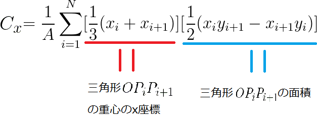

多角形の重心
重心とは物体の複数の部分に分けて考えたときにその点の周りのモーメントが0であるような点である.
重心が (x1,y1),(x2,y2), ..., (xN,yN), 質量が m1, m2 ,mN であるようなN個の物体からなる物体の重心G(gx,gy)は次の式で与えられる.
$$
\small g_x = \sum_{i=1}^{N}m_ix_i/M,g_y = \sum_{i=1}^{N}m_iy_i/M
$$
(ただし M = m1 + m2 + ... + mN)
証明は WIkipedia参照 . 重み付き平均を取っているだけだと思えば直感的にも納得がいくと思われる.
注意 : 幾何的重心と物理的重心とを分けて考えることがあるが, 基本的に幾何的重心は密度が一定の剛体の重心だと思えばよい.
反対に, 物理的重心とは密度が一定でない剛体も考えた重心のことである.
ここでは当然ながら幾何的重心を考える. 

ここではある多角形がその面積を質量としてもつと考えることで, 物理の重心の公式を用いることにする.
天下り的であるが, 多角形の重心G(Cx,Cy)は次の式で与えられる.

$$
\small C_x = \frac{1}{6A}\sum_{i=1}^{N} (x_i+x_{i+1})(x_iy_{i+1}-x_{i+1}y_i), C_y = \frac{1}{6A}\sum_{i=1}^{N} (y_i+y_{i+1})(x_iy_{i+1}-x_{i+1}y_i)
$$
(ただし xk+1 = x1, yk+1 = y1)
この式は
$$
\small C_x = \frac{1}{A}\sum_{i=1}^{N} [\frac{1}{3}(x_i+x_{i+1})][\frac{1}{2}(x_iy_{i+1}-x_{i+1}y_i)] \\
\small C_y = \frac{1}{A}\sum_{i=1}^{N} [\frac{1}{3} (y_i+y_{i+1})][\frac{1}{2}(x_iy_{i+1}-x_{i+1}y_i)]
$$

と分解することで, 上述の多角形を三角形に分割して求める際と同じような考え方で理解できるであろう.(下図参考)

The center of polygon can be 

### Exercise

[SPOJ Lifting the stone](http://www.spoj.com/problems/STONE/)